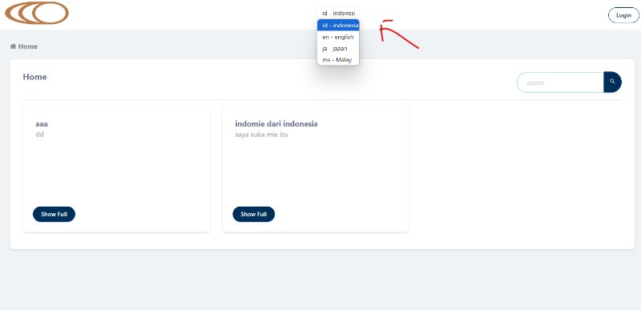
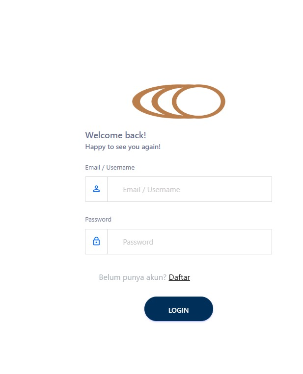
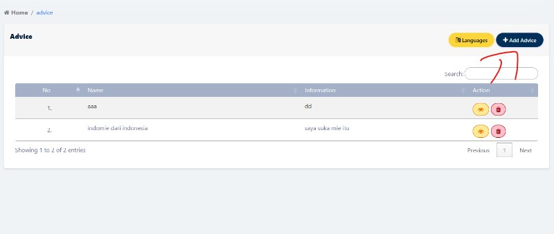
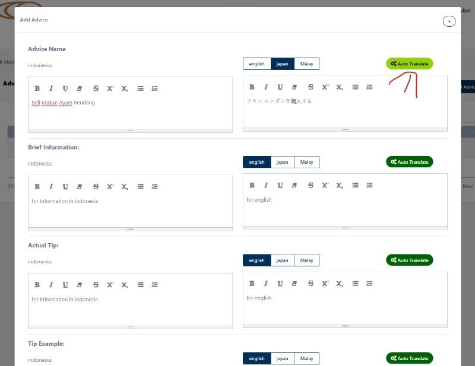
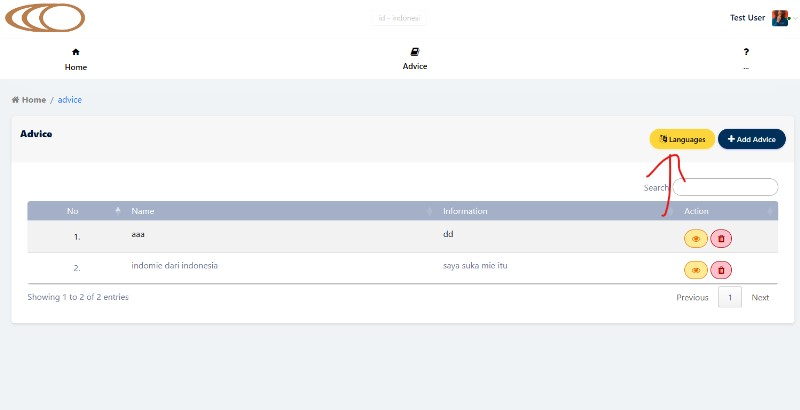
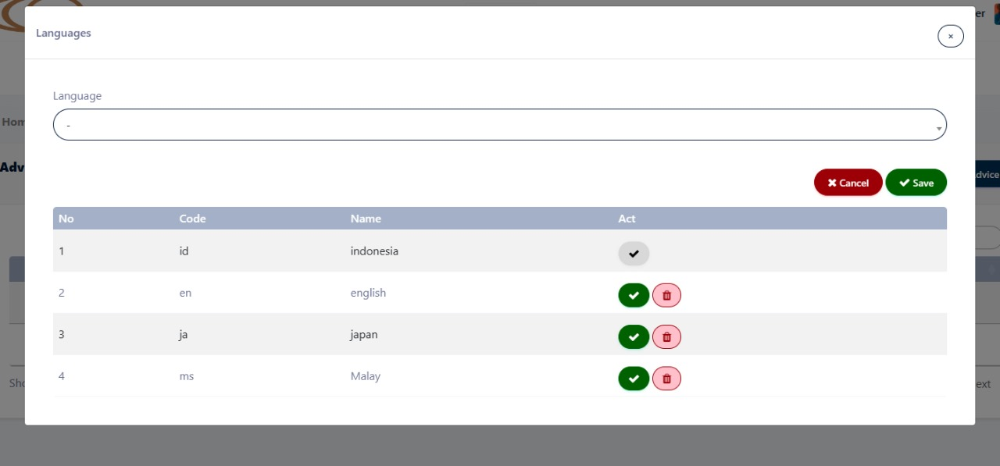

# Advice Management System

This is a simple system for managing advice, including translation features. Follow the instructions below to set up and use the application.

## Getting Started

### Language Change

1. **Change Language**: To change the language of the application, click the language button located above the header. This will update the UI to the selected language.

    {:width="300"}

### Accessing Advice Menu

2. **Login Required**: To access the Advice menu, you must be logged in. Use your credentials to log in. If you are not logged in, you will be redirected to the login page.

    {:width="300"}

3. **Add New Advice**:

    - After logging in, navigate to the Advice menu.
    - Click the "Add Advice" button to add a new piece of advice.
    - Fill in the required fields and save the advice.

    {:width="300"}

### Auto Translation

4. **Generate Translations**:

    - To translate the advice, click the "Auto Translate" button.
    - The system will generate translations based on the selected language.
    - After saving, only the advice entries in the selected language will be displayed.

    {:width="300"}

## Languages

1. **Language**:

    - CRUD Languange modal.

    {:width="300"}
    {:width="300"}

## Notes

-   Ensure you have the appropriate permissions and are logged in to access all features.
-   The application supports multiple languages, and translations are handled automatically.

## Contributing

If you wish to contribute to the project, please fork the repository and submit a pull request with your changes.

## Language

-   set default : {url}/language/{country code}
-   example : localhost/language/en

## To Run Advice Migration From Old Data

-   then php artisan migrate:advice {total data} {offset}
-   then php artisan migrate:advice 1000 0
-   1000 is example of rows and 0 is offset

-   run php artisan queue:work --queue=default --tries=3 --timeout=900

## Translation Docs

-   Endpoints Docs: https://docs.translateplus.io/
-   Api Key: https://app.translateplus.io/dashboard/api-keys

## License

This project is licensed under the MIT License. See the [LICENSE](LICENSE) file for details.
